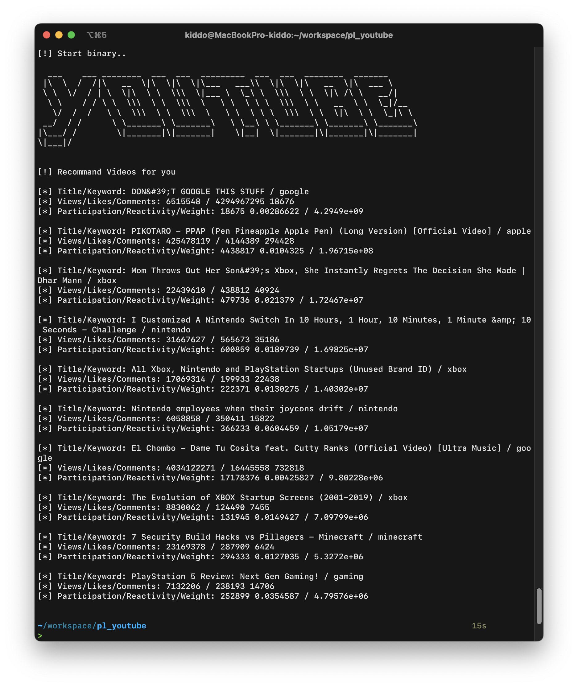

pl_youtube - recommand videos from [Youtube Statistics](https://www.kaggle.com/datasets/advaypatil/youtube-statistics?resource=download&select=videos-stats.csv) dataset

# Usage

## Quick Start

To build & run it right away for all UNIX users (Linux, macOS, etc.), I made a shell script:

    ./run.sh

## Detailed Version

To build it with cmake & make build system, type:

    cmake -B build -DCMAKE_BUILD_TYPE=Release
    make -C build

Now the binary is built on build/ directory. To run it:

    build/src/pl_youtube

Note that cmake, make, c++ compiler(g++, clang, etc.)  are required for the build.

# Description

pl_youtube is a command-line program to recommand videos from YouTube Statistics dataset. It requires the Cmake version 3.1+, and it is not platform specific. It is released to the public domain, which means you can modify it, redistribute it or use it however you like.

# Example

